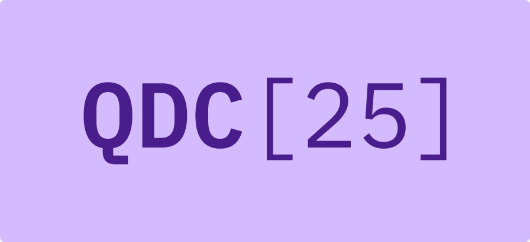

# IBM Quantum Developer Conference 2025

Welcome to the IBM Quantum Developer Conference 2025! These challenges are designed to test your quantum computing skills using the Qiskit product features announced during QDC. The competition spans three days and features two challenge tracks.

## Conference Agenda

### Wednesday 11/12

- 8:00-9:00 Check-in & Light Breakfast
- 9:00-12:30 Morning seminars
- 12:30-1:30 Lunch
- 1:30-3:30 Afternoon Seminars (Optimization & Simulation)
- 4:00-5:30 Track A & B challenges begin & Poster Showcase

### Thursday 11/13

- 8:00-9:00 Check-in & Light Breakfast
- 9:00-11:00 Speaker Sessions for Challenges
- 11:30-12:30 Poster Showcase & Challenges
- 12:30-1:30 Lunch
- 1:30-5:30 Poster Showcase & Challenges
- 5:30-8:00 Dinner & Entertainment

### Friday 11/14

- 8:00-9:00 Check-in & Light Breakfast
- 9:00-11:30 Morning Seminars
- 11:30-1:00 Lunch
- 1:00-4:00 Tutorial Sessions
- 4:00-4:30 Closing Remarks (Awards, Winner Talks, QDC[25] Wrap-up)
- 4:30-5:30 Cocktail Hour

## Installation and Setup

To participate, please complete the setup instructions outlined in the [INSTALL.md](./INSTALL.md) file of this repository. Remember to bring a laptop with internet access, as no devices will be provided at the venue.

## Challenge Notebooks

The challenge notebooks are available in their respective "Track" folders within the GitHub repository.

## Challenges Topics

Every afternoon during QDC, attendees will have the opportunity to participate in a hands-on coding challenges, where you will be able to practice using the latest tools and features highlighted in the morning seminars. You will be using Jupyter notebooks to complete the challenges, which can be found in this dedicated GitHub repository. To ensure you have the best challenge experience possible it is very important to follow the preparations steps outlined in the GitHub README prior to the event.

Every day there will be two challenges happening in parallel, and you may choose which track you would like to participate in based on your skills and interests. See below a summary of topics covered by each challenge:

### Track A: Simulation (Floor L1)
- Market Split
- Scattering and particle creation in 1D Ising Field Theory
- Sample-based Krylov Quantum Diagonalization
- Real-Time Dynamics in a (2+1)-D Gauge Theory

### Track B: Optimization(Floor L2)
- Maximum Independent Set
- Hadron Dynamics in the Schwinger Model
- Computing Solute-Solvent Interactions using Sample-based Quantum Diagonalization
- Quantum Approximate Multi-Objective Optimization (QMOO)

## Learning Resources

The seminars and challenges at QDC are designed to cover a broad range of advanced topics featuring Qiskit tools and capabilities. While participants are not expected to have a deep understanding of everything that will be covered we do recommend familiarizing yourself with the basics before attending the event. 

See the [cheat sheet](./challenges_cheat_sheet.md) for more information and links to various resources which may help get you started.

